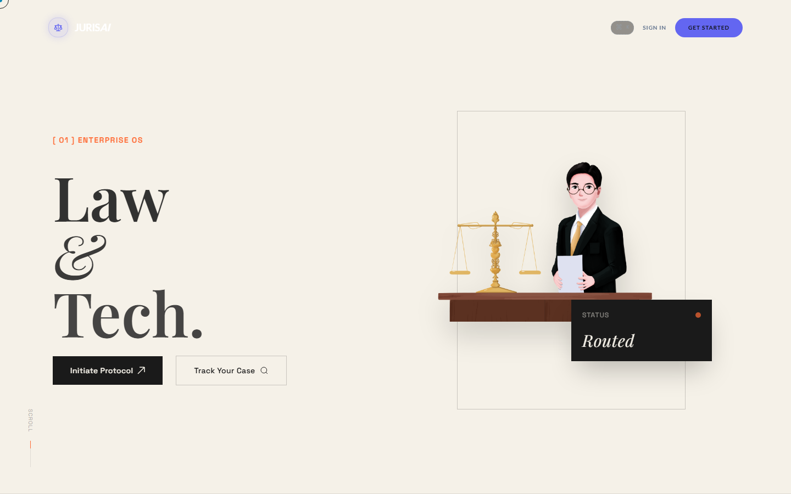
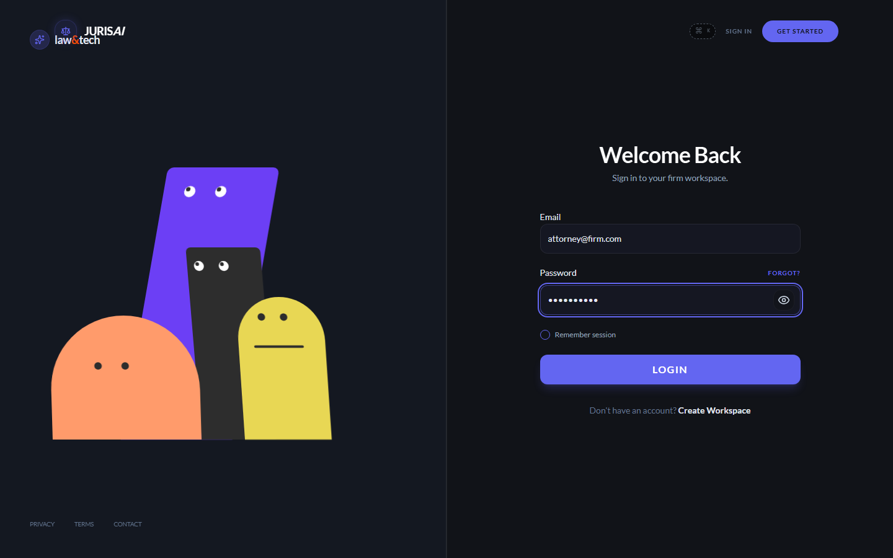
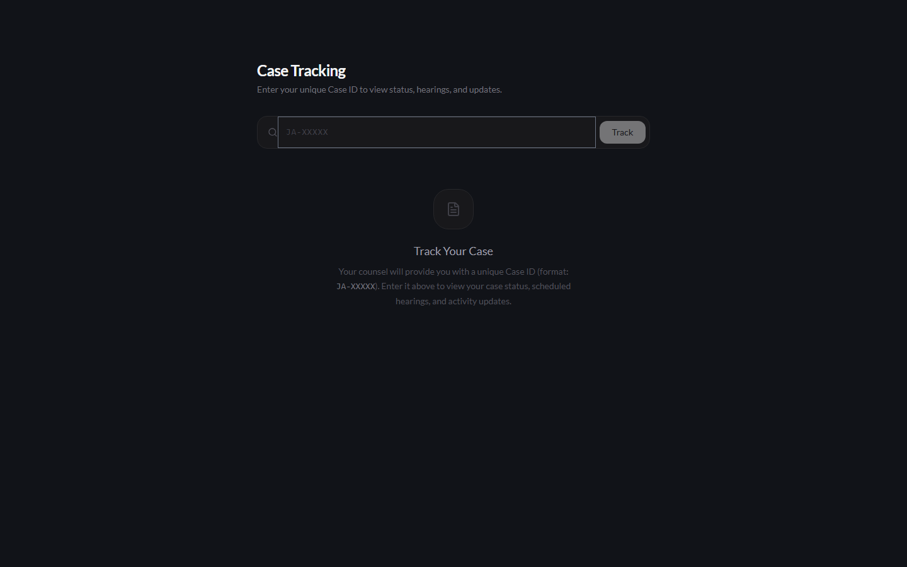

<div align="center">

# ⚖️ LegalForge

**AI-Powered Legal Intelligence Platform**

[](LICENSE)
[](backend/)
[](src/)
[]()
[](backend/requirements.txt)
[](package.json)

</div>

---

LegalForge is a full-stack legal intelligence platform that combines AI-powered document drafting, semantic legal research, and case management in a modern web interface. Built for Indian legal practice with support for NVIDIA Gemma-3n, local LLMs (Ollama), and Scrapling-powered web research.

## Screenshots

<table>
  <tr>
    <td></td>
    <td></td>
  </tr>
  <tr>
    <td align="center"><em>Editorial hero section with GSAP animations</em></td>
    <td align="center"><em>Login with credentials filled</em></td>
  </tr>
  <tr>
    <td></td>
    <td width="400"></td>
  </tr>
  <tr>
    <td align="center"><em>Public case tracking portal</em></td>
    <td align="center"></td>
  </tr>
</table>

## Features

- **🧠 AI Draft Generator** — Natural-language → polished legal document in one go. Unlike spreadsheet template fillers, describe the situation in plain language and AI picks the right template, modifies clauses to context, and drafts the full document. Bulk mode: craft 10+ personalized notices/agreements from a data grid with batch PDF/ZIP download — each draft AI-adapted to its specific entry.
- **🔬 RAG Research Engine** — Semantic search across Supreme Court judgments, IPC, CrPC, and Indian legal datasets via ChromaDB vector store.
- **📄 Deep Contract Review** — Upload a contract and get clause-level risk analysis cross-referenced against Indian case law and statutes via the RAG engine. Detects clauses conflicting with IPC, CrPC, IBC, or latest SC rulings, not just generic red flags.
- **📋 Case Management** — Full case dashboard with stages, hearings, daily updates, notes, and activity logs.
- **👥 Lawyer Directory** — Browse and connect with legal professionals within the firm.
- **🔗 Client Portal** — Public case tracking (`/track`) with real-time status, journey maps, and hearing schedules.
- **📊 Analytics & Insights** — Firm-wide metrics, case velocity, and trend analysis.
- **⚙️ Admin Panel** — User management, system oversight, and configuration.

## Architecture

```
legalai/
├── backend/                          # FastAPI Python server
│   ├── ai/                           # RAG pipeline, embeddings, LLM integration
│   ├── api/routes/                   # Route handlers
│   │   ├── auth.py                   # Login, register, token refresh
│   │   ├── drafts.py                 # Single & bulk draft generation, intent analysis
│   │   ├── lawyers.py                # Case CRUD, hearings, notes, daily updates
│   │   ├── research.py               # Legal search & research
│   │   └── ...
│   ├── services/                     # Business logic layer
│   │   ├── draft_service.py          # Template engine, PDF generation, bulk ZIP
│   │   ├── intent_service.py         # AI intent parser & template suggestion
│   │   ├── scrapling_research_service.py  # Web research via Scrapling
│   │   ├── ai_gateway.py             # Unified AI provider interface
│   │   ├── email_service.py          # Gmail/Resend email delivery
│   │   └── ...
│   ├── database/                     # Pydantic schemas, DB init
│   ├── main.py                       # FastAPI app entrypoint
│   └── config.py                     # Centralized env-based config
├── src/                              # React + Vite frontend
│   ├── pages/                        # Route-level page components
│   │   ├── DraftGenerator.jsx        # Intent-driven bulk draft generator
│   │   ├── LandingPage.tsx           # Editorial landing with GSAP animations
│   │   ├── LegalResearch.jsx         # Research + embedded draft flow
│   │   ├── CaseDashboard.tsx         # Case management dashboard
│   │   ├── ClientPortal.jsx          # Public case tracking
│   │   └── ...
│   ├── components/                   # Reusable UI (ui/, layout/, landing/, editorial/)
│   ├── lib/                          # API client, utilities, design tokens
│   ├── config.js                     # Frontend API URL config
│   ├── App.jsx                       # Router with auth guards
│   └── main.jsx                      # React entry point
├── scripts/                          # Automation & data ingestion
├── tests/                            # E2E & unit tests
├── docs/                             # Screenshots & documentation
├── .gitignore
├── docker-compose.yml
├── package.json
└── vite.config.js
```

## Draft Generator — Intent-Based Bulk Drafting

The Draft Generator (`/draft`) is the platform's flagship feature:

```
User describes intent (natural language)
  → AI parses: doc type, parties, tone, bulk vs single
  → Suggests template modifications & missing clauses
  → Single mode: fill details → AI generates polished draft
  → Bulk mode: data grid (add/remove rows, CSV import) → batch generate all → ZIP download
```

**Supported document types:** Legal Notice, Consumer Complaint, Rental Agreement, Affidavit, Power of Attorney, Legal Opinion

**Tones:** Neutral, Formal, Assertive, Conciliatory, Aggressive

**API:** `POST /api/draft/understand-intent` (intent parsing) + `POST /api/draft/bulk-generate` (batch generation)

## Getting Started

### Prerequisites

- **Node.js** 18+
- **Python** 3.11+
- **NVIDIA API Key** (or Ollama for local LLM)

### 1. Clone & Install

```bash
git clone https://github.com/armaa11/legalai.git
cd legalai

# Frontend
npm install

# Backend
cd backend
python -m venv .venv
.venv\Scripts\activate        # Windows
# source .venv/bin/activate   # macOS/Linux
pip install -r requirements.txt
cd ..
```

### 2. Configure Environment

```bash
cd backend
cp .env.example .env
# Edit .env with your API keys (NVIDIA, Supabase, JWT secret, etc.)
cd ..
```

### 3. Run

```powershell
# Frontend only
npm run dev              # http://localhost:5173

# Backend (separate terminal)
cd backend
python main.py           # http://localhost:8000
```

### 4. E2E Tests

```bash
# Headless mode (Playwright)
python tests/test_e2e_playwright.py

# Headed mode (watch browser)
python tests/test_e2e_live.py
```

## Tech Stack

| Layer | Technology |
|-------|-----------|
| Frontend | React 19, Vite 7, Tailwind CSS 4, React Router 7, Framer Motion |
| Backend | FastAPI, Uvicorn, SQLAlchemy, ReportLab (PDF) |
| AI/ML | NVIDIA Gemma-3n, Ollama (local), ChromaDB, sentence-transformers |
| Database | Supabase (PostgreSQL) |
| Auth | JWT (python-jose), bcrypt |
| Web Research | Scrapling (replaces Firecrawl) |
| Email | Resend, Gmail SMTP |
| Infra | Docker Compose |

## Environment Variables

See [`backend/.env.example`](backend/.env.example) for the full configuration reference.

| Variable | Description |
|----------|-------------|
| `NVIDIA_API_KEY` | NVIDIA API key for Gemma-3n inference |
| `SUPABASE_URL` | Supabase project URL |
| `SUPABASE_KEY` | Supabase anon/service role key |
| `JWT_SECRET` | JWT signing secret (change in production) |
| `RESEND_API_KEY` | Resend transactional email API key |
| `OLLAMA_MODEL` | Local LLM model name (fallback) |
| `SCRAPLING_FETCH_TIMEOUT` | Web research fetch timeout (seconds) |

## Security

- **Never commit `.env` files** — `.env.example` is the safe template
- All secrets loaded from environment variables at runtime
- JWT-based authentication with bcrypt password hashing
- CORS restricted in production configuration
- `backend/.env` is git-ignored via `.gitignore`

## License

MIT License — see [LICENSE](LICENSE) for details.

---

<div align="center">
  Built for the legal community • 2026
</div>
